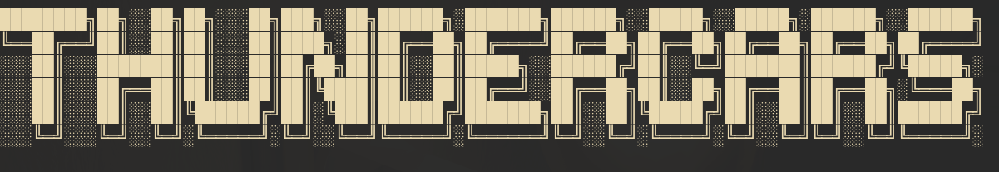

# Thundercars.gr





This Command Line interface is part of our project in Software Engineering class, Thundercars.
It's aim is to give admins a fast way to interract with the database.


Quick Start
-----------

You simply need to clone the repo and run the installation script.
```
$ git clone https://github.com/ntua/TL20-35.git
$ cd cli-client
$ python3 install.py
```


### Usage

    $ EVCharge35 --help
    Usage: EVCharge35 [OPTIONS] COMMAND [ARGS]...

        This command line interface was part of our project in Software
        Engineering class, during the 7th semester of Electrical and Computer
        Engineering School of National Technical University of Athens.


    Options:
      --help              Show this message and exit.

    Commands:
      admin               Admin commands for managing the software.
      healthcheck         Perform a quick healthcheck
      login               Login
      logout              Logout
      resetsessions       Reset all charging processes
      sessionsperev       List charging processes per Vehicle
      sessionsperpoint    List charging processes per point
      sessionsperstation  List charging processes per current provider
      sessionsperprovider List charging processes per station   


Dependencies:
--------------

The software was developed using:

* Python 3.9.2
* Click Framework 8.0.0a1
* PyTest 6.2.2

In order to build, you need:
* Python3
* pip3
* setuptools

We highly recommend you to build and run it in a protected environment.
